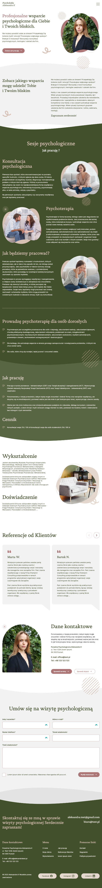

# psychology-clinic-website

The repository contains the source code for the graphic design, which was provided by an advertising agency in Figma. The goal of the project was a fully responsive representation of the interface. The design was optimized for different devices, ensuring flexibility and visual consistency across all screens. 

### Technologies used:
- HTML
- CSS
- JavaScript
- PHP

